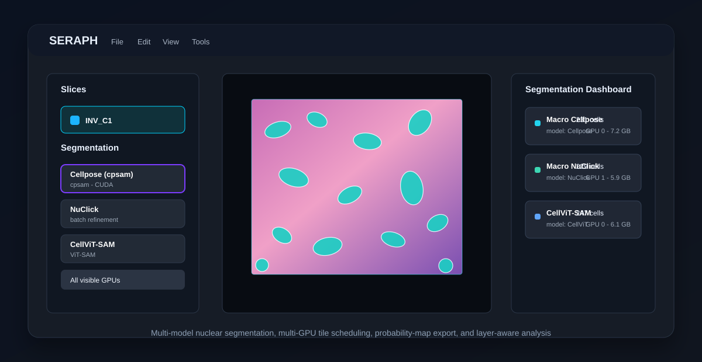

---
tags:
  - IC
  - readme
  - seraph
  - pathology
  - nuclear-segmentation
---

<p align="center">
  
</p>

# SERAPH

**Segmentation Engine for Research in Anatomical Pathology and Histology**

SERAPH is a PyQt6 desktop application for opening, slicing, segmenting, reviewing, and exporting nuclei from large microscopy and whole-slide images. It is built for pathology research workflows where multiple segmentation strategies need to be compared on the same regions of interest.

<p align="center">
  
</p>

**Image and Multimedia Data Science Laboratory (IMSCIENCE)**  
Developed by **Matheus Fagundes** under the Scientific Initiation Program at IMSCIENCE.

---

## Highlights

- Open large microscopy images and WSI files without loading the full image into RAM.
- Select regions of interest with grid-based or freehand brush tools.
- Run multiple nuclear segmentation methods on the same slice.
- Compare results layer by layer with independent visibility and color controls.
- Run Cellpose, CellViT, and NuClick across multiple GPUs when more than one CUDA device is visible.
- Export nuclei, slices, metadata, HDF5 datasets, TIFF probability maps, and project files.
- Track execution time, model name, and starting VRAM in the segmentation dashboard.
- Remove border-touching nuclei across all layers for cleaner method comparisons.
- Save and reopen portable `.lab` projects with segmentation layers preserved.

---

## Segmentation Models

| Model | Mode | Notes |
|---|---|---|
| Cellpose `cpsam` | Whole-tile batch | Main fast baseline. Supports GPU selection and multi-GPU tile scheduling. |
| NuClick | Click-based and pipeline refinement | Can refine Cellpose detections using one centroid per nucleus. Supports GPU selection inside the macro pipeline. |
| iDISF | Click-based interactive | CPU graph-based segmentation via Interactive Dynamic and Iterative Spanning Forest. Uses a local crop, one foreground click, and border background seeds; crop, N0, iterations, path cost, c1, and c2 are configurable in the UI. |
| CellViT-SAM | Whole-tile batch | ViT/SAM-based nuclear segmentation. Supports GPU selection and multi-GPU tile scheduling. |
| PathoSAM (ViT-L) | Whole-tile batch | Histopathology SAM via `micro_sam`; exports raw probability maps. Uses conservative OOM retry with `batch_size=1`. |
| DINOSim | Similarity-guided segmentation | Few-shot/zero-shot similarity method using reference points or Cellpose-derived prompts. |

Current multi-GPU support:

| Model | Single GPU selection | Multi-GPU tile scheduling |
|---|---:|---:|
| Cellpose | Yes | Yes |
| NuClick | Yes, in pipeline | Yes, in pipeline |
| iDISF | CPU | No GPU needed |
| CellViT-SAM | Yes | Yes |
| PathoSAM | Limited | Not in-process; needs per-GPU subprocess isolation |
| DINOSim | Not yet exposed in UI | Not yet |

---

## Recent Analysis Tools

### Segmentation Dashboard

Each segmentation layer records:

- layer/model name;
- number of detected nuclei;
- execution time;
- CUDA device used when available;
- free VRAM at the start of the operation.

This makes it easier to compare methods and detect memory-related slowdowns.

### Probability Map Export

Existing segmentation layers can export probability/confidence maps as **TIFF** to avoid lossy compression. This is useful for inspecting whether a model produced a real continuous confidence map or a binary/label-like output.

Supported in practice:

- Cellpose: captures Cellpose cell probability output.
- PathoSAM: captures `micro_sam` foreground probability when available.
- CellViT: exports the raw foreground logit margin, because softmax probabilities often saturate visually.

### Border Segmentation Cleanup

The layer menu includes:

```text
Remove Border Segmentations
```

This removes polygons from all segmentation layers in the current slice when any polygon point touches the slice border. It is intended for fair comparison between methods by excluding partial nuclei cut by the ROI boundary.

---

## Multi-GPU Workflow

SERAPH normally isolates the best compatible GPU at startup so incompatible CUDA devices do not break PyTorch. To expose all GPUs to the application, start it with `SERAPH_MULTI_GPU=1`.

Recommended Git Bash command for RTX 50-series plus older CUDA GPUs:

```bash
cd "$HOME/OneDrive/Documentos/MyLife/Scientific Research/SERAPH" && unset CUDA_VISIBLE_DEVICES && export SERAPH_MULTI_GPU=1 && if [ ! -d venv-sm120 ]; then python -m venv venv-sm120; fi && source venv-sm120/Scripts/activate && python -m pip install --upgrade pip && pip install -r requirements-sm120.txt && python main.py
```

When this mode is active, the segmentation panel can show options like:

```text
Auto
GPU 0 - NVIDIA GeForce RTX 5060
GPU 1 - NVIDIA GeForce RTX 2060
All visible GPUs
```

For multi-slice runs, SERAPH uses a dynamic work queue: whenever a GPU finishes a tile, it takes the next pending tile instead of waiting for a preassigned static batch.

---

## Installation

### Recommended Windows Setup for RTX 50-Series / `sm_120`

Use `requirements-sm120.txt`, which installs a PyTorch CUDA build with `sm_120` support:

```bash
cd "$HOME/OneDrive/Documentos/MyLife/Scientific Research/SERAPH"
python -m venv venv-sm120
source venv-sm120/Scripts/activate
python -m pip install --upgrade pip
pip install -r requirements-sm120.txt
python main.py
```

To use multiple GPUs, prefer the one-line command in the Multi-GPU Workflow section.

### Standard Windows Setup

```powershell
python -m venv venv
venv\Scripts\activate
pip install -r requirements.txt
python main.py
```

### macOS

```bash
brew install libvips openslide
python3 -m venv venv
source venv/bin/activate
pip install -r requirements-macos.txt
python main.py
```

---

## Supported Image Inputs

SERAPH supports common microscopy and WSI formats through OpenSlide, Pillow, and optional pyvips:

- `.ndpi`
- `.svs`
- `.mrxs`
- `.tiff` / `.tif`
- `.png`
- `.jpeg` / `.jpg`
- `.webp`
- `.bmp`

Large WSI files are read through a multiscale pyramid so only the visible or selected region is decoded.

---

## Core Workflow

1. Open a microscopy or WSI image.
2. Create one or more slices/ROIs with the grid or brush tool.
3. Select one or more slices in the sidebar.
4. Choose a segmentation method in the segmentation panel.
5. Select the GPU mode when available.
6. Run the model or NucleAI centroid-refinement pipeline with NuClick or iDISF.
7. Compare layers in the dashboard and layer menu.
8. Optionally remove border-touching nuclei for cleaner method comparison.
9. Export nuclei, probability maps, HDF5 datasets, or project files.

---

## Export Options

| Export | Output |
|---|---|
| Slices | Cropped ROI images with masks applied |
| Nuclei | Per-nucleus image crops grouped by slice/layer |
| Nuclei HDF5 | ML-ready `.h5` dataset with images, masks, labels, and metadata |
| Probability map | TIFF confidence/probability maps from segmentation layers |
| Metadata | CSV/JSON descriptors with dimensions and labels |
| Project | `.lab` JSON project file with slices, masks, layers, and metadata |

---

## Architecture

SERAPH follows a clean layered structure:

```text
app/
  domain/          Pure entities and geometry
  application/     Use-case services
  infrastructure/  Model adapters, config, I/O
  interface/gui/   PyQt6 desktop interface
```

Key modules:

| Module | Responsibility |
|---|---|
| `app/domain/tile.py` | Slice geometry, masks, segmentation layers, serialization |
| `app/application/batch_segmentation_service.py` | Whole-tile segmentation orchestration |
| `app/application/interactive_segmentation_service.py` | Click/point-based segmentation orchestration |
| `app/infrastructure/ml_models/` | Cellpose, NuClick, iDISF, CellViT, PathoSAM, DINOSim adapters |
| `app/interface/gui/components/macro_pipeline_panel.py` | Batch/macro segmentation UI and multi-GPU workers |
| `app/interface/gui/components/layer_dropdown.py` | Layer visibility, deletion, border cleanup |
| `app/interface/gui/components/properties_panel.py` | Segmentation dashboard and metadata |

---

## Project Files

`.lab` files are JSON projects containing:

- source image references;
- slice geometry and masks;
- per-slice metadata;
- segmentation layers;
- model names;
- execution timing;
- VRAM metadata;
- layer visibility/colors.

Probability maps are intentionally not stored inside `.lab` project JSON because they can be large NumPy/TIFF-like arrays. Export them separately as TIFF when needed.

---

## Keyboard Shortcuts

| Action | Shortcut |
|---|---|
| Undo | `Ctrl+Z` |
| Redo | `Ctrl+Y` |
| Clear polygons | `C` |
| Grid tool | `G` |
| Brush tool | `B` |
| Segment nucleus | `S` |
| Eraser brush | `E` |
| Selection brush | `A` |
| Back to canvas | `Esc` |
| Zoom | `Ctrl+Mouse Wheel` |
| Horizontal scroll | `Shift+Mouse Wheel` |

---

## Notes and Limitations

- PathoSAM uses `micro_sam`, which accepts `"cuda"` but not indexed device strings like `"cuda:1"` in the current in-process adapter.
- For PathoSAM multi-GPU execution, the safer future design is one subprocess per GPU with separate `CUDA_VISIBLE_DEVICES`.
- CellViT-HIPT support is close to the existing `CellViT256` path, but requires compatible checkpoints.
- CellViT-Virchow likely requires the newer CellViT++ inference stack and separate model weights.
- If the app is already running, changing `SERAPH_MULTI_GPU` will not expose hidden GPUs; restart the process.

---

## Dependencies

| Package | Purpose |
|---|---|
| PyQt6 | Desktop GUI |
| Pillow | Image I/O fallback and masks |
| openslide-python / openslide-bin | WSI reading |
| pyvips | Optional high-performance image I/O |
| torch / torchvision | Deep-learning backend |
| cellpose | Cellpose `cpsam` segmentation |
| scikit-image / scipy / numpy | Image processing and scientific computing |
| opencv-python-headless | Contours and mask processing |
| h5py | HDF5 export |
| psutil | Hardware/memory detection |

---

<p align="center">
  <b>IMSCIENCE - Merging raw Data Science with complex Cell Microscopy.</b>
</p>
